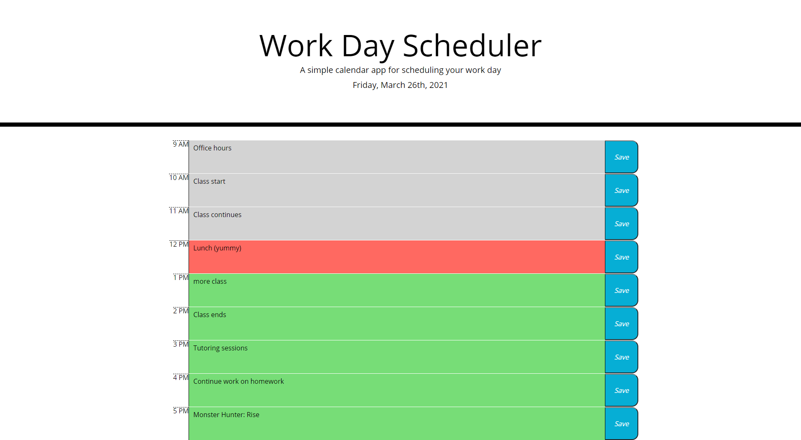

# Work-Day-Planner
# Decription
This is the finalized work day planner. I worked alone to get the beginning code functionality to work, and then worked with a tutor to condense it 1/4 its original length. The user can see if the common business hours are in the past, present, or future. They can also input text in the text areas and, upon clicking the save button, the data is stored, so if they should leave and come back, the data will persist.

# Deployed Site
Here is the link to the deployed site.

[Deployed Site](https://shrwnwilliams.github.io/work-day-planner/)